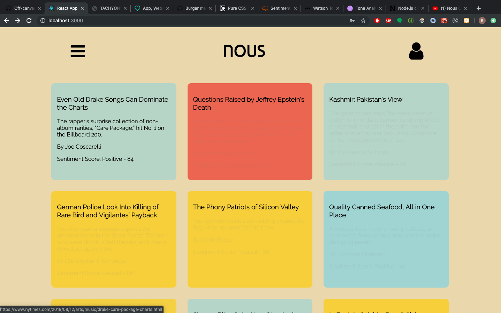
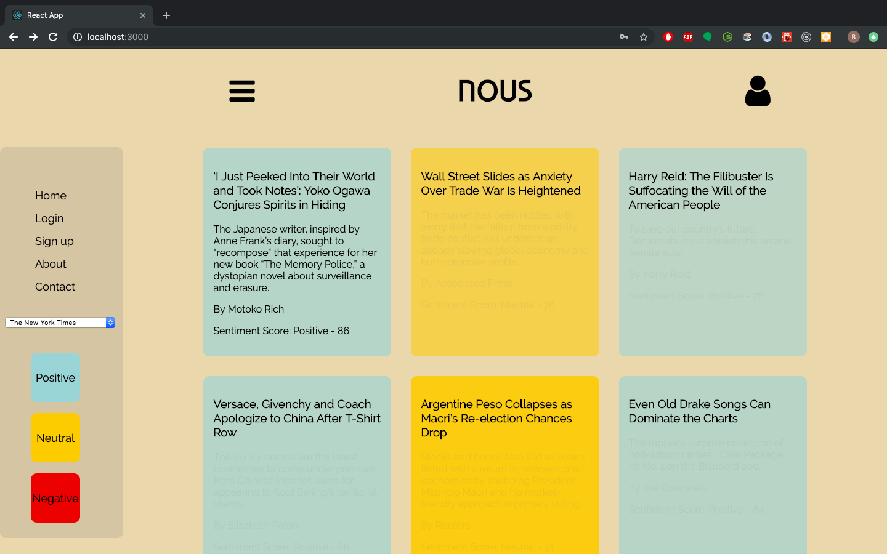
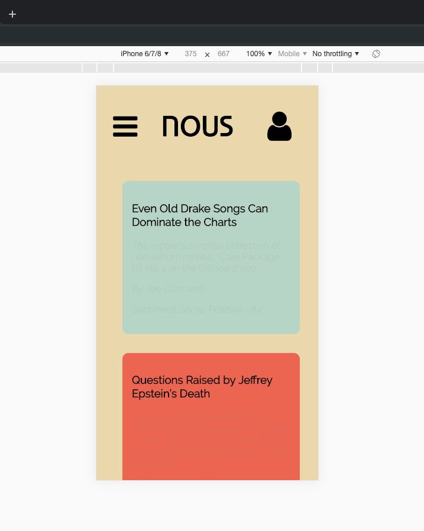

# NOUS
> A way to reduce the cognitive load of reading the news.

I made this app so that the experience of reading the news would be a little less distracting, ugly, and infuriating.  Tell it what news source you'd like to read and it will grab the stories from the front page and run them through a machine learning algorithm that makes a guess about the sentiment, or emotional content of a story.  It then renders that emotional content as a color, giving you the ability to decide whether or not you'd like to choose to read the story.

I made this because most websites,  especially news outlets, design their page layouts and content to maximize engagement.  This means they are trying to persuade, cajole, trick, and ensnare you into looking at what they want you to look at, for as long as possible.

Some even track your behavior and try to only show you content designed to delight or infuriate you, to maximize your interest.  I don't think this is a good way to absorb information.  Hopefully this tool will help!

Thanks for visiting!

[Demo Video](https://youtu.be/cACWEbEmuk0)
[Mobile View Demo Video](https://youtu.be/iXt64cRudbE)






## Installation

1. Fork and Clone down the repo
2. Visit[newsapi.org/](http://newsapi.org/) to get a Free API Key
3. Visit[meaningcloud.com/](http://www.meaningcloud.com/) to get a Free API Key
4. In the root directory of the project make a file called .env and define environmental variables
 ```
REACT_APP_NEWS_API_KEY = theapikeyuoutgot782734983242 
REACT_APP_MEANING_API_KEY = theotherpaikeyuoutgot782734983242
```
5. In a terminal, navigate to the root directory and run 

```
npm install 
```

6. Then run 

```
npm start 
```

## Meta

Ben Reilly –  benjamin.reilly@gmail.com

Distributed under the MIT license. See ``LICENSE`` for more information.

[https://github.com/Ibenthinkin/Nous-Front-End](https://github.com/ibenthinkin/)

## Contributing

1. Fork it (<https://github.com/Ibenthinkin/Nous-Front-End/fork>)
2. Create your feature branch (`git checkout -b feature/fooBar`)
3. Commit your changes (`git commit -am 'Add some fooBar'`)
4. Push to the branch (`git push origin feature/fooBar`)
5. Create a new Pull Request
